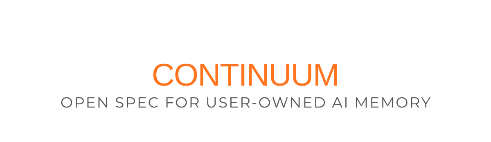

# Continuum – User-Owned Memory for AI Tools

**An open specification for portable, privacy-preserving AI context.**

Continuum describes a system that lets users carry identity and long-term context across AI tools (ChatGPT, Claude, Gemini, future models) without platform lock-in or loss of privacy.

This repository contains the full specification.  
I’m not building it. I’m publishing it so someone else can.

---

## The Problem

AI tools are stateless across platforms.

You explain your work to one model, switch tools, and start over. This wastes time, fragments thinking, and prevents AI from functioning as a long-term collaborator.

The limitation isn’t model quality – it’s missing user-owned memory.

---

## The Proposal

Continuum is a **local, encrypted context layer** that sits between the user and AI tools.

- Memory belongs to the user, not the platform
- Context is shared selectively and explicitly
- Works across providers and interfaces
- Designed for long-term use (years, not sessions)

Think: identity and memory as infrastructure, not a chatbot feature.

---

## How It Works (Conceptually)

- User runs a local agent (e.g. browser extension)
- Context is captured, compressed, and encrypted locally
- Only approved slices are shared with AI tools
- No provider has full visibility or ownership

Zero-knowledge by design.

---

## Example

ChatGPT: “I’m building a multi-tenant SaaS app…”
[User promotes context to Continuum]

Later, Claude:
“Optimize my database queries.”

Claude:
“Given your multi-tenant SaaS architecture…”

No re-explaining. No account coupling. No hidden state.

---

## What’s in This Repo

- **47-page whitepaper**
  - Architecture and data model
  - Encryption and trust boundaries
  - Memory compression strategy
  - Business and incentive design

- **Concrete user scenarios**
- **Competitive analysis**
- **Phased implementation roadmap**

This is a specification, not a prototype.

---

## Design Principles

- User-owned data
- Explicit consent
- Provider-agnostic
- Open protocol
- No dark patterns
- No silent accumulation

If memory is valuable, users should control it.

---

## Why Open

This should not be a proprietary moat for a single AI company.

If built correctly, it becomes shared infrastructure – like email, not Slack.

So the entire spec is public under MIT.

---

## License

MIT.  
Build it, fork it, commercialize it.

Attribution appreciated, not required.

---

## Author

Mats Stefan Bengtsson

If you’re seriously considering implementing this and want input on design or trade-offs, I’m happy to discuss.

---

## If You Build It

Please reach out to me: stefan.nu@gmail.com

I want to be:
1. Your first real user
2. A critical early tester
3. Someone who helps pressure-test assumptions

---

## Projects Using This Spec

- Your project here

---

Last updated: January 2026
